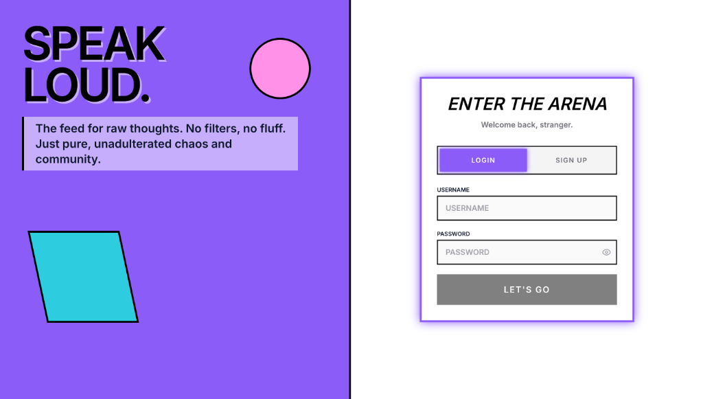
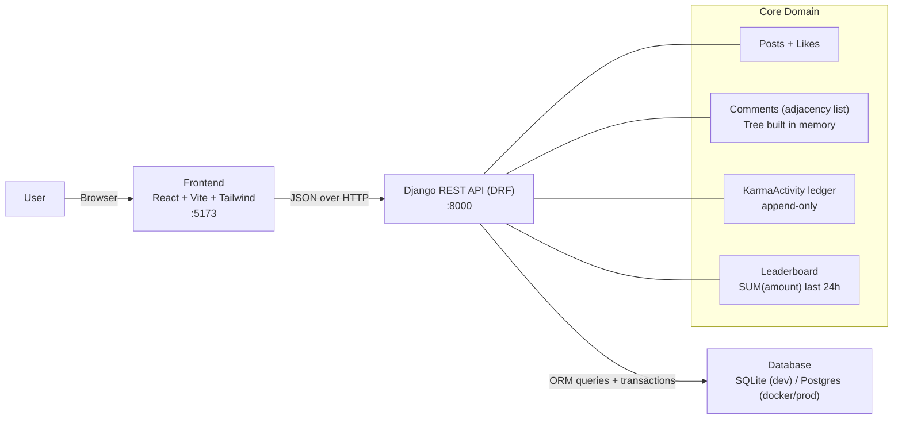
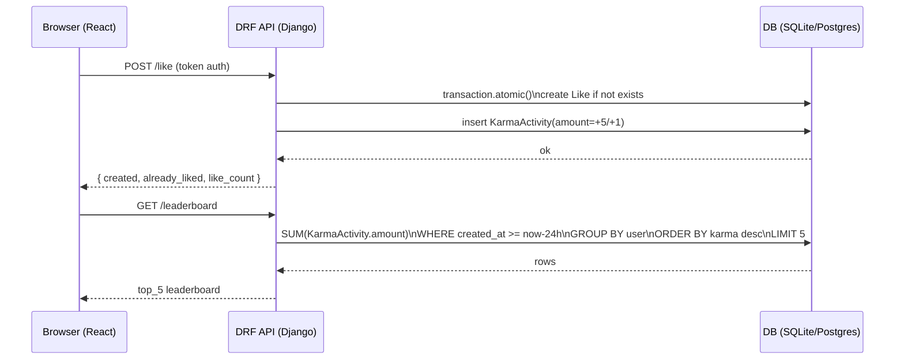

# ECHO — The Cyber-Pop Community Feed ⚡️

> "Speak Loud. No filters, no fluff. Just pure, unadulterated chaos and community."




## What is Echo?

Echo is a **high-performance community feed prototype** built for speed and craftsmanship. It’s designed to handle complex threaded discussions, real-time gamification, and dynamic leaderboards.

It demonstrates how to build scalable social features (like nested comments and time-windowed leaderboards) without falling into common performance traps (like the N+1 problem).

### 🚀 What can you do here?

- **The Feed**: Post your raw thoughts. See what others are saying.
- **Threaded Discussions**: Dive deep. Reply to comments, and reply to replies. The discussion tree supports unlimited depth.
- **Gamification**: Earn Karma for your contributions.
    - **+5 Karma** when someone likes your Post.
    - **+1 Karma** when someone likes your Comment.
- **The Leaderboard**: A real-time "Top 5" widget showing who earned the most Karma in the **last 24 hours**.

---

## 🏗 System Architecture & Data Flow

Echo is built with a separation of concerns, ensuring scalability and type safety.

### 🧭 Architecture Diagram (runtime)



### 🔄 The Data Flow

1.  **User Action**: A user posts a comment or likes a post on the **React Frontend**.
2.  **API Layer**: The frontend sends a JSON request to the **Django REST Framework (DRF)** API.
    *   *Authentication*: Token-based auth validates the user session.
3.  **Backend Logic & Safety**:
    *   **Concurrency**: `transaction.atomic()` locks the database row to prevent race conditions (e.g., double-voting).
    *   **Optimization**: For comments, the backend fetches a flat list and creates a nested tree in memory (O(n)) before sending it back, avoiding the N+1 problem.
4.  **Database (SQLite/Postgres)**: The data is persisted.
    *   **Ledger System**: Instead of updating a "Karma" field, we insert a new `KarmaActivity` row. This provides an immutable history of all points earned.
5.  **Live Updates**: The Leaderboard recalculates dynamically by summing the last 24 hours of `KarmaActivity`.

### 🧾 Example Request Flow (like → karma → leaderboard)



### Stack
- **Backend**: Django & Django REST Framework (DRF)
- **Frontend**: React (Vite) + Tailwind CSS
- **Database**: SQLite (default) / PostgreSQL (production ready)

### Key Technical Decisions

#### 1. The N+1 Solution (Nested Comments)
Instead of recursive SQL queries, Echo fetches **all comments for a post in a single query**.
- We use an **Adjacency List** model (`parent_id`).
- The backend fetches the flat list, efficiently builds the nested tree structure in-memory (O(n)), and sends the JSON tree to the frontend.
- **Result**: Loading a thread with 100 comments takes **1 SQL query**, not 101.

#### 2. The Gamification Ledger
We do **not** store a "Total Karma" integer on the User model.
- Karma is tracked in an **append-only `KarmaActivity` ledger**.
- This ensures data integrity and allows us to calculate "Karma earned in the last X hours" dynamically.
- **Concurrency**: Database transactions and unique constraints ensure you can't "double like" anything.

---

## 🛠 Quickstart

### Backend Setup
```bash
cd backend
python -m venv .venv
source .venv/bin/activate
pip install -r requirements.txt
python manage.py migrate
python manage.py createsuperuser
python manage.py runserver
```

### Frontend Setup
```bash
cd frontend
npm install
npm run dev
```

### Docker (optional)
```bash
docker compose up --build
```

Visit `http://localhost:5173` to enter the arena.

---
© 2026 Echo.
